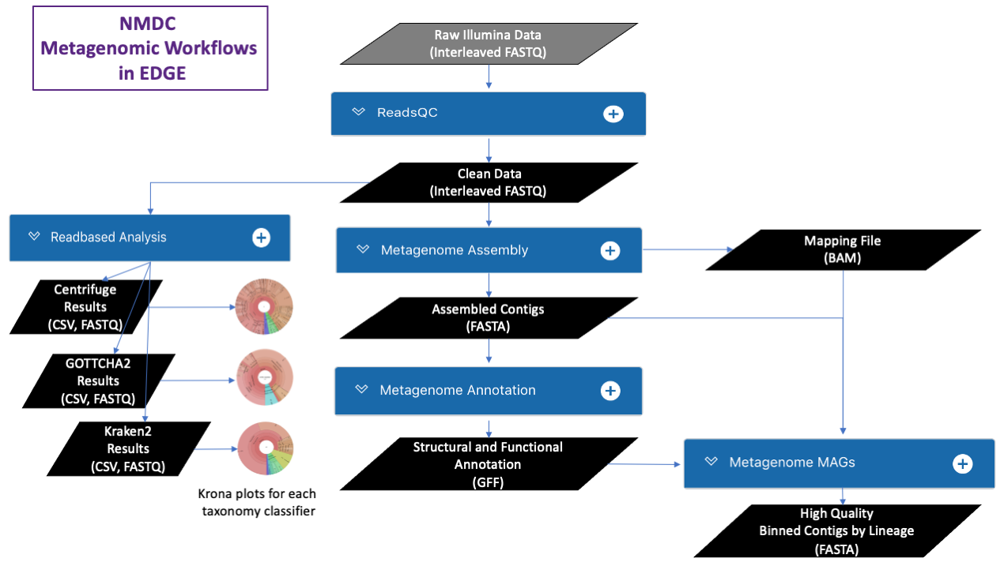

{width="1.3688527996500437in"
height="0.9583333333333334in"}

**NMDC EDGE Quick-Start**

# 

# Register for an account 

# Users must register for an account within the NMDC EDGE platform. 

#  {width="6.666666666666667in" height="3.394873140857393in"}

# Running a workflow 

# All of the NMDC Metagenomic workflows are connected in EDGE, so that the output of one workflow can automatically be the input for the next workflow if several metagenomic workflows are selected.

#  {width="6.524589895013123in" height="3.670718503937008in"}

# To run a workflow, the user must provide a Project/Run Name with no spaces (underscores are fine). The user then selects the workflow(s) desired from the drop-down menu and the input files from the available list of files and clicks 'Submit'. 

# {width="6.969099956255468in" height="3.9016393263342084in"}

# Output in EDGE

# The link for 'My Projects' opens the list of projects for that user. Links are provided to share or unshare projects with specific colleagues, make the projects public or private, or delete projects. Clicking on the icon to the left of a project name opens up the results page for the project. 

# {width="7.084471784776903in" height="2.825657261592301in"}

# 

# 

# 

# As an example, the results from Read-based Analysis are shown in the next two figures. A summary includes classified reads and number of species identified for all three taxonomy classifiers. The top ten organisms identified by each tool at three taxonomic levels is also provided.

# {width="6.858000874890639in" height="3.9205369641294836in"}

# Tabs for each of the classification tools provide more in-depth results are in the Detail section and include Krona plots for the results at each of the taxonomic levels. All files for results can be downloaded. 

# {width="6.935024059492563in" height="3.9016393263342084in"}
