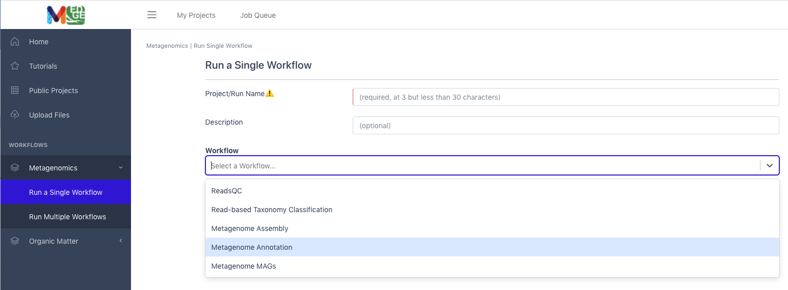
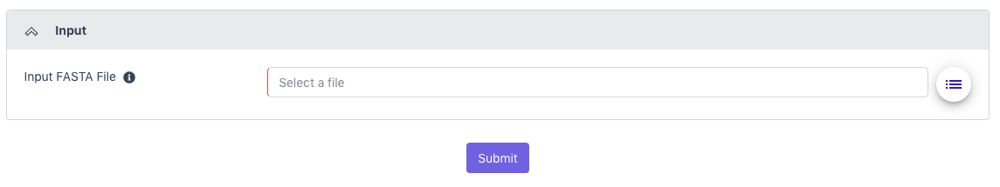
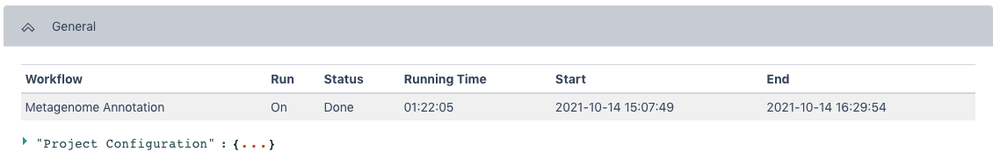
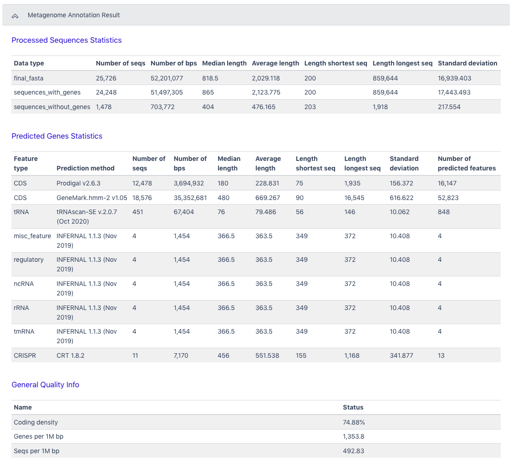
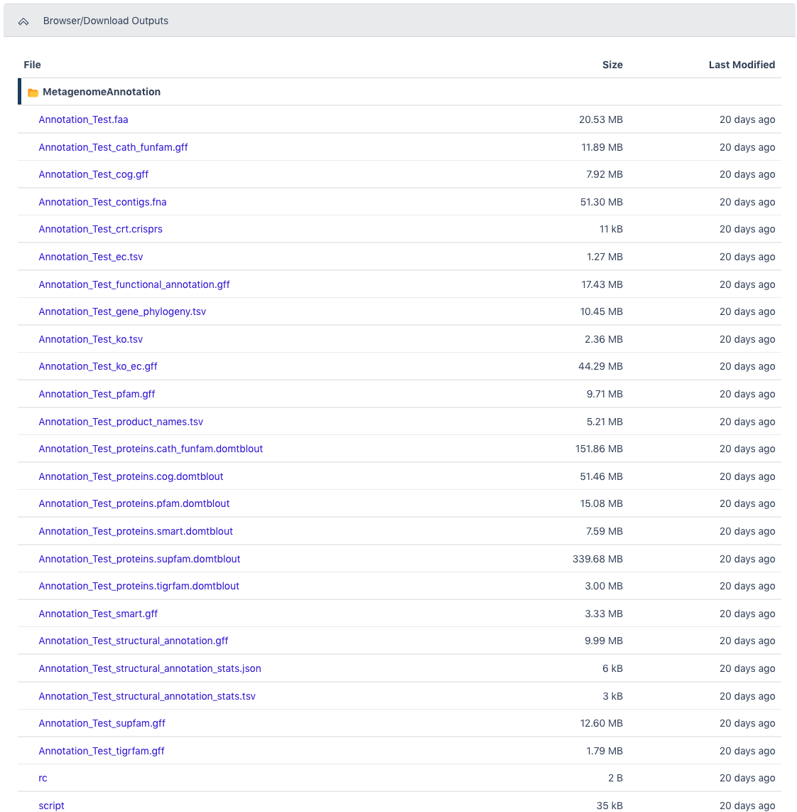

# Metagenome Annotation Workflow (v1.0.0)

{width="4.714372265966754in"
height="1.4457403762029746in"}

## Overview

This workflow takes assembled metagenomes and generates structural and
functional annotations.

## Running the Workflow

Currently, this workflow can be run in [NMDC
EDGE](https://nmdc-edge.org/home) or from the command line. (CLI
instructions and requirements are found
[here.](https://nmdc-workflow-documentation.readthedocs.io/en/latest/chapters/4_MetaGAnnotation_index.html))

## Input

Metagenome Annotation requires assembled contigs in a FASTA file. This
input can be the output from the Metagenome Assembly workflow and this
is recommended.

-   **Acceptable file formats:** .fasta, .fa, .fna, .fasta.gz, .fa.gz,
    .fna.gz

## Details

The workflow uses a number of open-source tools and databases to
generate the structural and functional annotations. The input assembly
is first split into 10MB splits to be processed in parallel. Depending
on the workflow engine configuration, the split can be processed in
parallel. Each split is first structurally annotated, then those results
are used for the functional annotation. The structural annotation uses
tRNAscan_se, RFAM, CRT, Prodigal and GeneMarkS. These results are merged
to create a consensus structural annotation. The resulting GFF is the
input for functional annotation which uses multiple protein family
databases (SMART, COG, TIGRFAM, SUPERFAMILY, Pfam and Cath-FunFam) along
with custom HMM models. The functional predictions are created using
Last and HMM. These annotations are also merged into a consensus GFF
file. Finally, the respective split annotations are merged together to
generate a single structural annotation file and single functional
annotation file. In addition, several summary files are generated in TSV
format.

## Software Versions 

-   

-   Conda

-   tRNAscan-SE \>= 2.0

-   Infernal 1.1.2

-   CRT-CLI 1.8

-   Prodigal 2.6.3

-   GeneMarkS-2 \>= 1.07

-   Last \>= 983

-   HMMER 3.1b2

-   TMHMM 2.0

## 

## Output

The main outputs are the structural annotation file and the functional
annotation file. The functional annotation file can be an input for the
MAGs Generation workflow.

Primary Output Files Description

  -----------------------------------------------------------------------
  Structural Annotation   Consensus structural annotation file from
                          multiple tools (.gff)
  ----------------------- -----------------------------------------------
  Functional Annotation   Consensus functional annotation file from
                          multiple tools (.gff)

  KEGG summary            KEGG gene function tabular summary (.tsv)

  EC summary              Enzyme Commission tabular summary (.tsv)

  Gene phylogeny summary  Gene phylogeny tabular summary (.tsv)
  -----------------------------------------------------------------------

**Running the Metagenome Annotation Workflow in NMDC EDGE**

Select a workflow

1.  From the Metagenomics category in the left menu bar, select 'Run a
    Single Workflow'.

2.  Enter a ***[unique]{.underline}*** project name with no spaces
    (underscores are fine).

3.  A description is optional, but helpful.

4.  Select 'Metagenome Annotation' from the dropdown menu under
    Workflow.

{width="7.439728783902012in"
height="2.7430555555555554in"}

Input

This workflow accepts assembled Illumina data in FASTA format as the
input; the file can be compressed. (It is highly recommended to input
the assembled contigs from the Metagenome Assembly workflow.)
**Acceptable file formats:** .fasta, .fa, .fna, .fasta.gz, .fa.gz,
.fna.gz.

5.  Click the button to the right of the input blank for data to select
    the data file for the analysis. (If there are separate files, there
    will be two input blanks.) A box called 'Select a File' will open to
    allow the user to find the desired file(s) from previously run
    projects, the public data folder, or files uploaded by the user.

6.  Then click 'Submit'.

{width="7.5in"
height="1.4083333333333334in"}

Output

The General section of the output shows which workflow was run and the
run time information.

{width="7.5in"
height="1.1402777777777777in"}

The Metagenome Annotation Result section has statistics for Processed
Sequences, Predicted Genes, and General Quality Information from the
workflow.{width="7.3752930883639545in"
height="6.694444444444445in"}

The Browser/Download Output section provides output files available to
download. The primary results are the functional annotation and the
structural annotation files (.gff). The functional annotation file is
required input for the MAGs Generation workflow along with the assembled
contigs.
{width="7.390839895013124in"
height="7.522916666666666in"}
